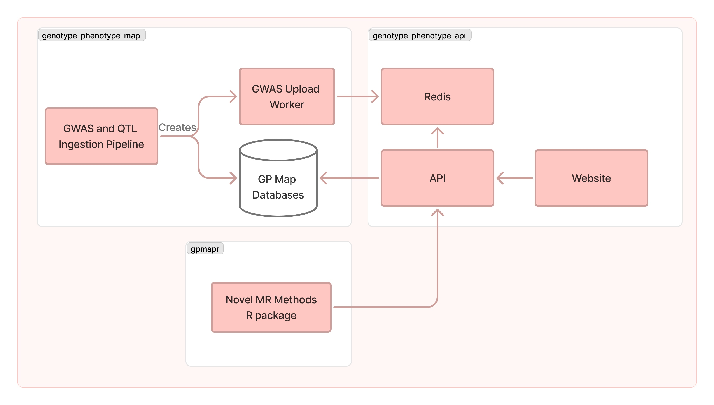

# Genotype-phenotype Map Website


This is the repository that hosts code for the website (frontend and backend) for the Genotype-phenotype Map project.  More information about the project can be found [here](https://github.com/MRCIEU/genotype-phenotype-map/wiki) and the website can be found [here](https://gpmap.opengwas.io).

## Background

Using [fastapi](http://fastapi.tiangolo.com) framework with a postgres database to store genotype-phenotype map data.

## Overview



## Setup and Running

### Development

You will need to have the following installed:

- [Docker](https://docs.docker.com/get-docker/) and/or [Docker Compose](https://docs.docker.com/compose/install/)
- [Python 3.12](https://www.python.org/downloads/)
- Node.js (v20.0.0 or higher), preferably using [nvm](https://github.com/nvm-sh/nvm)

1. Clone the repository:

   ```
   git clone https://github.com/mrcieu/genotype-phenotype-api.git
   cd genotype-phenotype-api
   ```

2. Create the `.env` files

   There are 2 `.env` files, one for frontend and one for backend.

   It's easiest to use the `.env.test` file as a template.  This will use a small curated test database in `tests/test_data/gpm_small.db`

   * `cp .env.test .env`
   * `cp frontend/.env.test frontend/.env`

3. Run the code using docker compose:

   The are two docker compose profiles, `web` and `all`.

   * `docker-compose --profile web up --build --detach`: runs the website, API, and redis
   * `docker-compose --profile all up --build --detach`: runs above and the gwas upload worker

   Docker compose will start the following services:
   * The frontend will be available at `http://localhost:5173`
   * The API will be available at `http://localhost:8000`
   * Redis will be available at `redis://redis:6379`
   * A pipeline worker, which will be built from [this repository](https://github.com/MRCIEU/genotype-phenotype-map), and pulled from docker hub

   Both the frontend and backend will reload when code changes are detected.

   If you don't want to use docker, you can run the frontend and backend separately.
   
   Frontend: 
   * `npm install #only needed once`
   * `npm run dev #to run the frontend service`

   Backend:
   * `python -m venv .venv #only needed once`
   * `source .venv/bin/activate #every time you open a new terminal`
   * `pip install -r requirements.txt #only needed once, or every time requirements.txt changes`
   * `uvicorn app.main:app --host 0.0.0.0 --port 8000 --reload`


**Possible Issues:**

Segmentation fault: If you are getting segmentation fault errors when building the frontend, try running docker compose with BUILDKIT disabled: `DOCKER_BUILDKIT=0 docker-compose --profile all up --build`

strconv.Atoi: parsing "": invalid syntax: If you are getting this error, try running `docker system prune`, then rebuild and remove orphans: `docker-compose --profile all up --build --remove-orphans`

## Production

Fill me in later.  There is some instructions in the [wiki](https://github.com/MRCIEU/genotype-phenotype-api/wiki/Public-Website-and-Oracle-Cloud).

* [Frontend README can be found here](frontend/README.md)

## CI/CD

The project includes a GitHub Actions workflow for Continuous Integration and Deployment. On each push to the main branch, it will:

1. Run the unit tests
2. Build a Docker image
3. Push the image to Docker Hub

## Contributing

1. Fork the repository
2. Create your feature branch (`git checkout -b feature/AmazingFeature`)
3. Commit your changes (`git commit -m 'Add some AmazingFeature'`)
4. Push to the branch (`git push origin feature/AmazingFeature`)
5. Open a Pull Request

## License

This project is licensed under the [GPL3 License](LICENSE).
