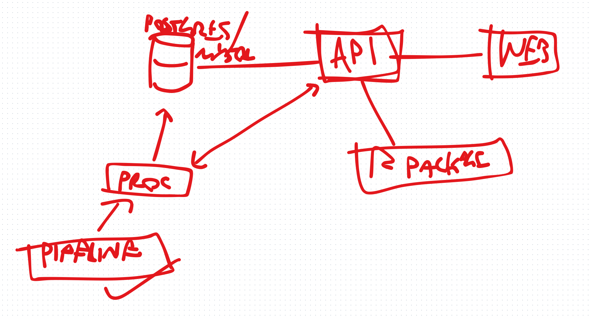
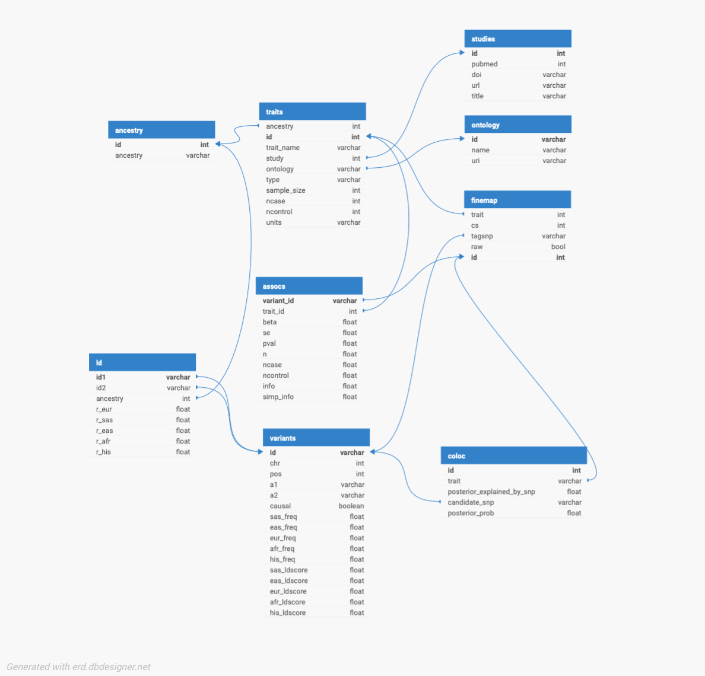

# Genotype-phenotype map API

## Background

Using [fastapi](http://fastapi.tiangolo.com) framework with a postgres database to store genotype-phenotype map data.

## Overview



## Database design



## Endpoints

- List traits
- List regions
- LD between variants

## Prerequisites

- Docker and Docker Compose
- Visual Studio Code with Remote - Containers extension for development

## Setup and Running

### Development

1. Clone the repository:
   ```
   git clone https://github.com/mrcieu/genotype-phenotype-api.git
   cd genotype-phenotype-api
   ```

2. Open the project in VSCode:
   ```
   code .
   ```

3. When prompted, click "Reopen in Container". This will start the development environment.

4. Once the container is built and running, you can start the FastAPI server by running:
   ```
   uvicorn app.main:app --host 0.0.0.0 --port 8000 --reload
   ```

5. The API will be available at `http://localhost:8000`, and the code will hot-reload on changes.

Or if not using VSCode

1. Clone the repository:
   ```
   git clone https://github.com/mrcieu/genotype-phenotype-api.git
   cd genotype-phenotype-api
   ```

2. Build and run the Docker containers:
   ```
   docker-compose up --build
   ```

3. The API will be available at `http://localhost:8000`


## Running Tests

To run the unit tests, make sure you're in the development container, then execute:

```
pytest app/test_main.py
```

If you're not in the development container, you can run the tests using Docker Compose:

```
docker-compose run web pytest app/test_main.py
```

## CI/CD

The project includes a GitHub Actions workflow for Continuous Integration and Deployment. On each push to the main branch, it will:

1. Run the unit tests
2. Build a Docker image
3. Push the image to Docker Hub (using secrets DOCKER_USERNAME and DOCKER_PASSWORD configured in github repo)

## Contributing

1. Fork the repository
2. Create your feature branch (`git checkout -b feature/AmazingFeature`)
3. Commit your changes (`git commit -m 'Add some AmazingFeature'`)
4. Push to the branch (`git push origin feature/AmazingFeature`)
5. Open a Pull Request

## License

This project is licensed under the GPL3 License.
