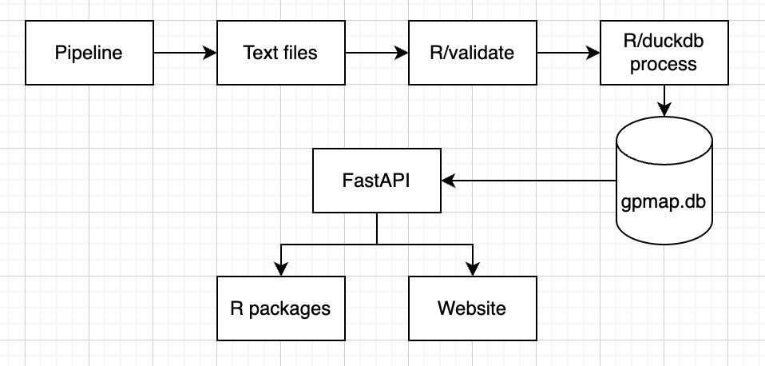

# Genotype-phenotype Map Website


This is the repository that hosts code for the website (frontend and backend) for the Genotype-phenotype Map project.  More information about the project can be found [here](https://github.com/MRCIEU/genotype-phenotype-map/wiki) and the website can be found [here](https://gpmap.opengwas.io).

## Background

Using [fastapi](http://fastapi.tiangolo.com) framework with a postgres database to store genotype-phenotype map data.

## Overview



## Setup and Running

### Development

You will need to have the following installed:

- [Docker](https://docs.docker.com/get-docker/) and/or [Docker Compose](https://docs.docker.com/compose/install/)
- [Python 3.12](https://www.python.org/downloads/)
- Node.js (v20.0.0 or higher), preferably using [nvm](https://github.com/nvm-sh/nvm)

1. Clone the repository:

   ```
   git clone https://github.com/mrcieu/genotype-phenotype-api.git
   cd genotype-phenotype-api
   ```

2. Create a `.env` file

   It's easiest to use the `.env.test` file as a template.  This will use a small curated test database in `tests/test_data/gpm_small.db`

3. Run the code using docker compose:

   ```
   docker compose --profile all up --build --detach
   ```
   This will start the backend and frontend services.

   If you are making changes to the frontend or backend, you can run docker-compose for everything except the bit you want to change.
   
   For example, if you are making changes to the frontend
   * `docker compose --profile backend up --build --detach`
   * `npm install #only needed once`
   * `npm run dev #to run the frontend service`
   
   Note, for `npm run dev`, the frontend will be available at `http://localhost:5173`

   Alternately, if you want to make changeses to the backend
   * `docker compose --profile frontend up --build --detach`
   * `python -m venv .venv #only needed once`
   * `source .venv/bin/activate #every time you open a new terminal`
   * `pip install -r requirements.txt #only needed once`
   * `uvicorn app.main:app --host 0.0.0.0 --port 8000 --reload`

The docker compose will start the following services:
* The frontend will be available at `http://localhost:80`
* The API will be available at `http://localhost:8000`
* Redis will be available at `redis://redis:6379`
* A pipeline worker, which will be built from [this repository](https://github.com/MRCIEU/genotype-phenotype-map), and pulled from docker hub

## Production

No production yet but a dev version is available - 

Setup a tunnel (need to be on vpn):

```
ssh -L 8000:localhost:8000 <username>@ieu-p1.epi.bris.ac.uk
```

Then check e.g.

```bash
curl http://localhost:8000/health
```

Or connect to http://localhost:8000/docs on your browser.


* [Frontend README can be found here](frontend/README.md)

## CI/CD

The project includes a GitHub Actions workflow for Continuous Integration and Deployment. On each push to the main branch, it will:

1. Run the unit tests
2. Build a Docker image
3. Push the image to Docker Hub (using secrets DOCKER_USERNAME and DOCKER_PASSWORD configured in github repo)

## Contributing

1. Fork the repository
2. Create your feature branch (`git checkout -b feature/AmazingFeature`)
3. Commit your changes (`git commit -m 'Add some AmazingFeature'`)
4. Push to the branch (`git push origin feature/AmazingFeature`)
5. Open a Pull Request

## License

This project is licensed under the [GPL3 License](LICENSE).
